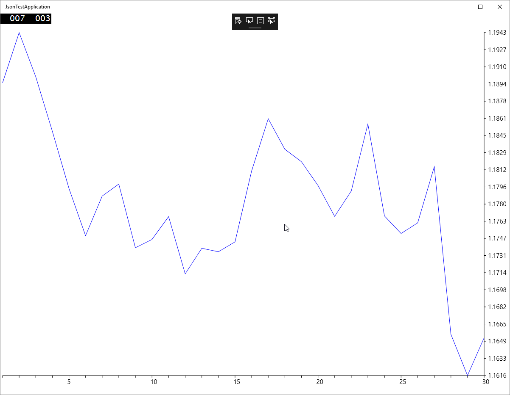

# JsonTestApplication

While I was learning to make Windows Store Apps, I thought it would be cool to get real-time forex EUR-USD charts for last 30 days. I found that Oanda had a REST API for retrieving candle data. After the data is ready then we simply draw the chart. To get this to work you need to get your own token key from Oanda. It was amazing to see this works in the Windows Phone emulator.

Tags: C#, Windows Store Apps, Json, Forex
